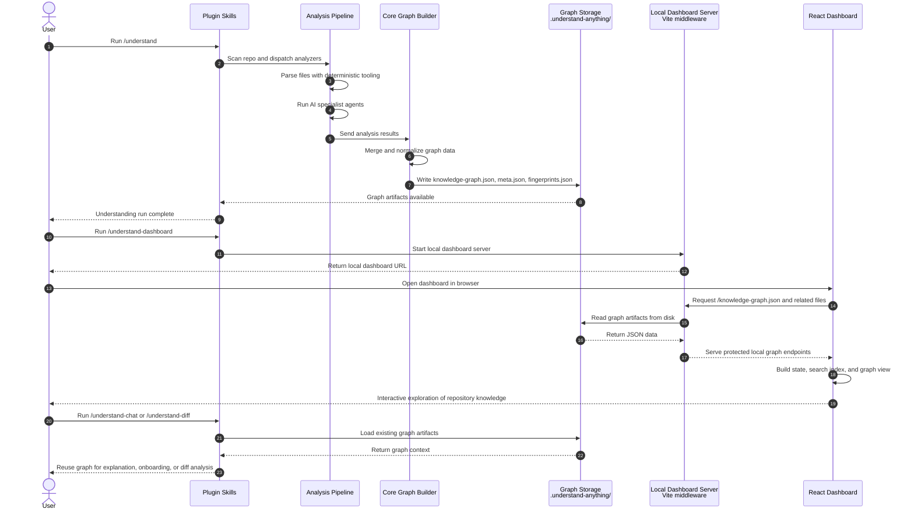

# Understand-Anything Sequence Diagram

This diagram shows the main runtime path from the user's command to graph generation and dashboard rendering.

## Legend

- `User` starts the workflows.
- `Plugin Skills` represents commands like `/understand` and `/understand-dashboard`.
- `Analysis Pipeline` represents deterministic analysis plus AI-agent orchestration.
- `Core Graph Builder` normalizes and assembles graph data.
- `Graph Storage` is the local `.understand-anything/` directory.
- `Local Dashboard Server` is the Vite middleware that serves graph files locally.
- `React Dashboard` is the browser UI.

## Diagram

## Reading Notes

The key observation is that graph generation happens before the dashboard becomes useful. The dashboard is mostly a viewer for artifacts that already exist on disk.

That is why the system feels local-first:

- analysis produces files
- files become the system's source of truth
- UI and follow-up commands reuse those files rather than calling a traditional backend
